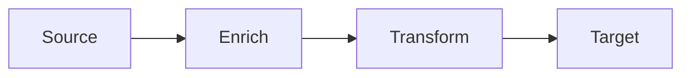
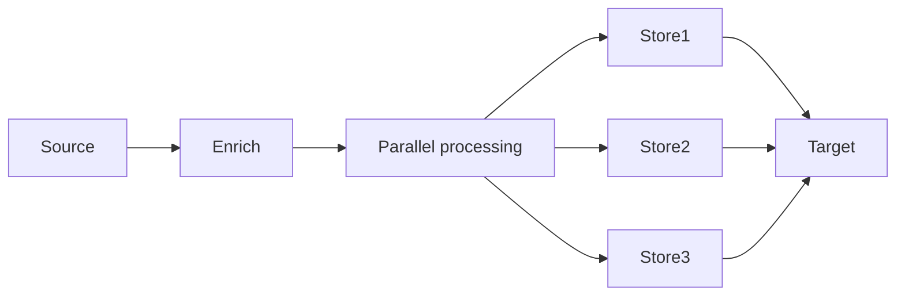
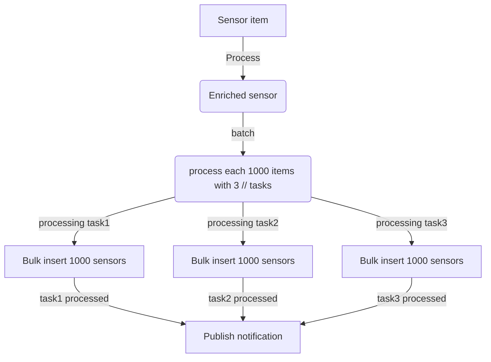

# DataflowBuilder


## Overview

`DataflowBuilder` simplifies the creation of dataflow pipelines, making it easier to build, manage, and test complex data processing workflows. With its fluent API, you can quickly set up pipelines that handle various data processing tasks efficiently.

One of the key features of DataflowBuilder is its support for parallel asynchronous tasks executions.

By leveraging dataflow blocks, you can process data concurrently, making efficient use of system resources and improving the performance of your applications.
This is especially useful for CPU-intensive or I/O-bound operations where tasks can benefit from parallelism.

## Features 

- Type safe Builder
- Process huge data effectively without memory leak
- Implement any async or synchronous operations like access to database, api call or any cloud resource call
- Multi-source extension to implement data streaming join
- Extensible: add your own block extensions

## Implemented blocks

- FromSource<T> => Source Block
- Process and ProcessAsync  => Input/Output Function block  (T=>T ou T => U)
- Batch =>  Batch input elements (T => T[])
- ToTarget or TaTargetAsynbc => Final block action

## Getting Started

### Installation

To use `DataflowBuilder` in your project, install it via NuGet Package Manager
[DotnetKit.DataflowBuilder NUGET](https://www.nuget.org/packages/DotnetKit.DataflowBuilder)

```bash
Install-Package DotnetKit.DataflowBuilder
```

Or using the .NET CLI:

```bash
dotnet add package DotnetKit.DataflowBuilder
```

### How it works

- Define typed item source and build another blocks with fluent API builder
- Build the pipeline
- Send item

blocks could transform, enrich, group each data (item) sent to the pipeline

#### Sequential pipeline flow



#### Pipeline flow with parallelization



### Basic Usage

Here is a simple example to get you started with `DataflowBuilder`.

**Create a Pipeline:**

```csharp
using DotnetKit.DataflowBuilder;
using System.Threading.Tasks;

public async Task RunPipeline()
{
    // build the pipeline
    var pipeline = DataFlowPipelineBuilder.FromSource<int>()
        .Process(a => a * 2)
        .ToTarget(a =>
        {
            Console.WriteLine(a);
        })
        .Build();

    // run the pipeline
    for(var i=1;i<=5;i++)
        {
            await pipeline.SendAsync(1);
        }

    await pipeline.CompleteAsync();
}

```

**Result:**

```bash
2
4
6
8
10
```

### Advanced Usage

`DataflowBuilder` supports advanced operations like batching and grouping.

#### Batching

```csharp
var pipeline = DataFlowPipelineBuilder.FromSource<int>()
    .Batch(5)
    .ToTarget(batch =>
    {
        Console.WriteLine($"Batch received: {string.Join(",", batch)}");
    })
    .Build();

for (int i = 1; i <= 10; i++)
{
    await pipeline.SendAsync(i);
}

await pipeline.CompleteAsync();
```

#### Grouping

```csharp
var pipeline = DataFlowPipelineBuilder.FromSource<char[]>()
    .ProcessMany(chars => chars.GroupBy(c => c).Select(g => g.Key))
    .ToTarget(c =>
    {
        Console.Write(c);
    })
    .Build();

await pipeline.SendAsync("hello world".ToCharArray());
await pipeline.CompleteAsync();
```

#### Multi-source pipeline (JoinBlock implementation)

```csharp
        var expected = new List<string>() { $"HelloWorld-10", $"PingPong-8" };

        var result = new List<string>();
        var pipeline = DataFlowPipelineBuilder.FromSources<string, int>()
            .Process(items => $"{items.Item1}-{items.Item2}")
            .ToTargetAsync(item =>
            {
                result.Add(item);
                return Task.CompletedTask;
            })

            .Build();

        //Order of sending is important for sources 
        await pipeline.Send1Async("HelloWorld");
        await pipeline.Send1Async("PingPong");

        await pipeline.Send2Async("HelloWorld".Length);
        await pipeline.Send2Async("PingPong".Length);

        await pipeline.CompleteAsync();

        result.Should().BeEquivalentTo(expected);
```

#### Real world example with parallelization



```csharp

//Configuration stage (DI, startup process, or specific lifetime )
//Building sensor bulk insertion pipeline
var pipeline = DataFlowPipelineBuilder.FromSource<SensorEntity>()
    .Process(sensor => sensor.EnrichAsync())
    .Batch(1000)
    .ProcessAsync(async enrichedSensors => {
       await mongoDBClient.BulkInsertAsync(enrichedSensors)
    }, maxDegreeOfParallelism: 3)
    .ToTargetAsync(enrichedSensors =>
    {
     await servicebusDomainTopic.PublishCreatedSensorsNotificationAsync();
    })
    .Build();

//Execution stage (API or Event trigger )
//it could be billion of sensors
await foreach(var sensorPage in GetAllSensorsAsync())
    {
        await _pipeline.SendAsync(sensor);
    }
await _pipeline.CompleteAsync();
```

## Contributing

Contributions are welcome! Feel free to open issues or submit pull requests.

## License

This project is licensed under the MIT License.
